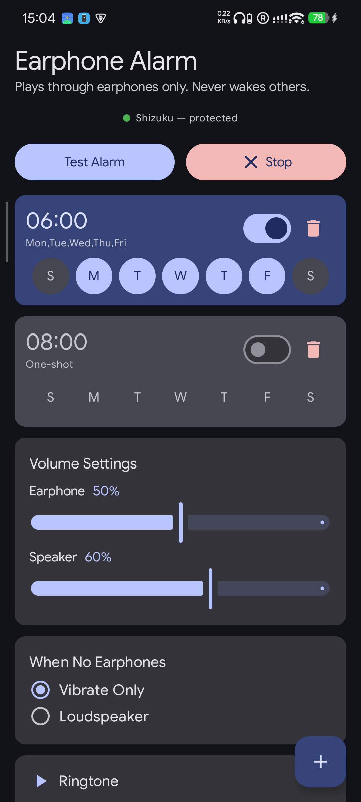

# SilentAlarm — Private Earphone Alarm

[中文](#chinese) | English

An Android alarm app that **only plays through earphones**, never through speakers — so you never wake others. Built with Kotlin, Jetpack Compose, and aggressive process-keeping to survive OEM killers.

## Screenshot

## Features

- **Multi-alarm** — unlimited alarms, one-shot or recurring (any day of week)
- **Earphone-only routing** — detects wired/BT/USB earphones, routes audio exclusively
- **BT wake-up** — 500ms silent preamble prevents Bluetooth audio truncation
- **Fallback modes** — vibrate-only or speaker when no earphones connected
- **Per-alarm volume** — separate earphone/speaker volume sliders
- **Custom ringtone** — system file picker, persisted across reboots
- **Quick Settings Tile** — toggle all alarms from the control center

##  Keeping Alive

Three-layer defense against OEM background killers:

| Layer | Mechanism                                                                           | Effect                                                                         |
| :---: | ----------------------------------------------------------------------------------- | ------------------------------------------------------------------------------ |
|   1   | **AccessibilityService** (**Removed** because it triggers Google Play restrictions) | System binds to our process → near-zero `oom_score_adj`                        |
|   2   | **Shizuku Privileged Shell**                                                        | `cmd deviceidle whitelist` + `am set-standby-bucket active` → exempt from Doze |
|   3   | **Watchdog Daemon**                                                                 | Shell script under Shizuku's UID monitors our PID → auto-restart if killed     |

## Setup

1. Install [Shizuku](https://shizuku.rikka.app/) or a fork like [thedjchi/Shizuku](https://github.com/thedjchi/Shizuku)
2. Open SilentAlarm and follow the guided setup to enable process-keeping features.

## Build

- minSdk 29 / targetSdk 36
- Kotlin 2.2.10, Compose BOM 2026.02, AGP 9.3

## TODOs

1. Add keep-alive capability on non-shizuku OS.
2. Add fallback to simple alarm if not closed manually, in case of missing earphone alarm.

---

## SilentAlarm — 隐私耳机闹钟

一款 **只在耳机中响铃、绝不外放** 的 Android 闹钟应用。Kotlin + Jetpack Compose 构建，利用 shizuku + Foreground Service保活，对抗 OEM 杀进程。

### 功能

- **多闹钟** — 无上限，支持单次或每周重复
- **仅耳机响铃** — 自动检测有线/BT/USB 耳机，音频只路由到耳机
- **蓝牙唤醒** — 500ms 静音前导，防止蓝牙音频截断
- **无耳机策略** — 仅振动 或 扬声器外放
- **独立音量** — 耳机/扬声器音量分开调节
- **自定义铃声** — 系统文件选择器
- **快捷磁贴** — 控制中心磁贴一键开关所有闹钟

### 使用指导

1. 安装并配置 [Shizuku](https://shizuku.rikka.app/) 或者 [Shizuku fork](https://github.com/thedjchi/Shizuku)
2. 打开 SilentAlarm ，根据引导启用保活功能