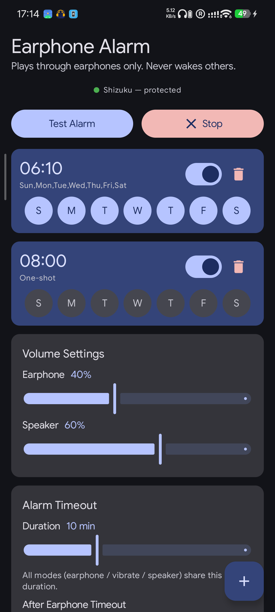
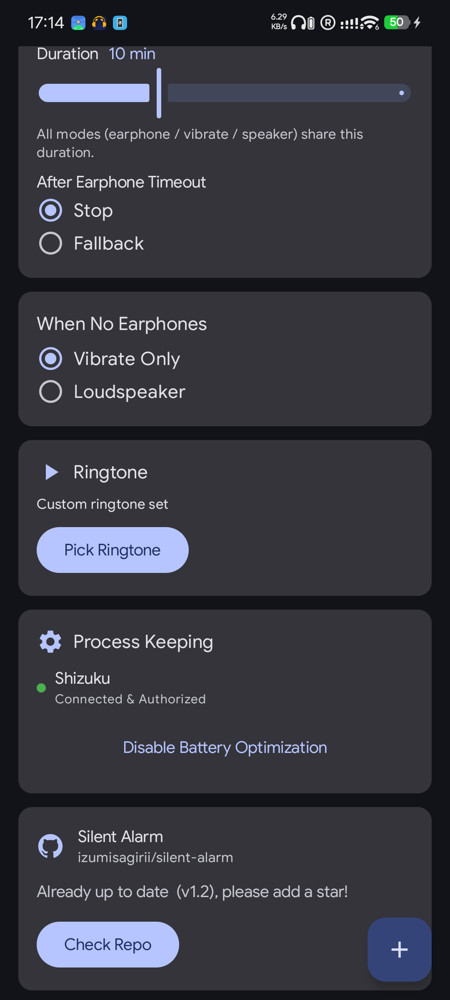

# SilentAlarm — Private Earphone Alarm

[中文](#chinese) | English

SilentAlarm - An Android alarm app that plays through earphones when connected, with a configurable vibrate-only or loudspeaker fallback. Built with Kotlin, Jetpack Compose, and a foreground service plus exact-alarm recovery to survive OEM killers.

## Screenshot

  

## Features

- **Multi-alarm** — unlimited alarms, one-shot or recurring (any day of week)
- **Earphone-first routing** — detects wired/BT/USB earphones and routes audio to them when present
- **BT wake-up** — 500ms silent preamble prevents Bluetooth audio truncation
- **Fallback modes** — vibrate-only or speaker when no earphones connected
- **Volume settings** — separate global earphone/speaker volume sliders
- **Custom ringtone** — system file picker, persisted across reboots
- **Quick Settings Tile** — toggle all alarms from the control center

##  Keeping Alive

Keep-alive strategy against OEM background killers:

| Layer | Mechanism                  | Effect                                                                 |
| :---: | -------------------------- | ---------------------------------------------------------------------- |
|   1   | **Exact Alarm Recovery**   | `setAlarmClock` for real alarms plus `setExactAndAllowWhileIdle` recovery alarm, so the system can wake the app even after the process is killed |
|   2   | **Foreground Service**     | `mediaPlayback` foreground service keeps the process alive while the app is closed or the screen is off |
|   3   | **Shizuku (optional)**     | `cmd deviceidle whitelist` + `am set-standby-bucket active` to reduce OEM battery-management interference |
|   4   | **Watchdog Daemon**        | Shell script under Shizuku's UID monitors the app and restarts the service if it is killed |

## Setup

1. Install [Shizuku](https://shizuku.rikka.app/) or a fork like [thedjchi/Shizuku](https://github.com/thedjchi/Shizuku) (Optional)
2. Open SilentAlarm and follow the guided setup to enable process-keeping features.

## Build

- minSdk 29 / targetSdk 36
- Kotlin 2.2.10, Compose BOM 2026.02, AGP 9.3

## TODOs

1. ~~Keep-alive recovery on non-Shizuku devices is handled by the exact-alarm recovery path; real-device coverage is still being validated.~~
2. ~~Add fallback to simple alarm if not closed manually, in case of missing earphone alarm.~~

---

## SilentAlarm — 隐私耳机闹钟

一款耳机优先响铃的 Android 闹钟应用，无耳机时可按设置选择仅振动或外放。Kotlin + Jetpack Compose 构建，利用精确闹钟恢复 + Foreground Service 保活，对抗 OEM 杀进程。

### 功能

- **多闹钟** — 无上限，支持单次或每周重复
- **耳机优先响铃** — 自动检测有线/BT/USB 耳机，有耳机时路由到耳机
- **蓝牙唤醒** — 500ms 静音前导，防止蓝牙音频截断
- **无耳机策略** — 仅振动 或 扬声器外放
- **音量设置** — 耳机/扬声器全局音量分开调节
- **自定义铃声** — 系统文件选择器
- **快捷磁贴** — 控制中心磁贴一键开关所有闹钟

### 使用指导

1. 安装并配置 [Shizuku](https://shizuku.rikka.app/) 或者 [Shizuku fork](https://github.com/thedjchi/Shizuku) (可选)
2. 打开 SilentAlarm ，根据引导启用保活功能
